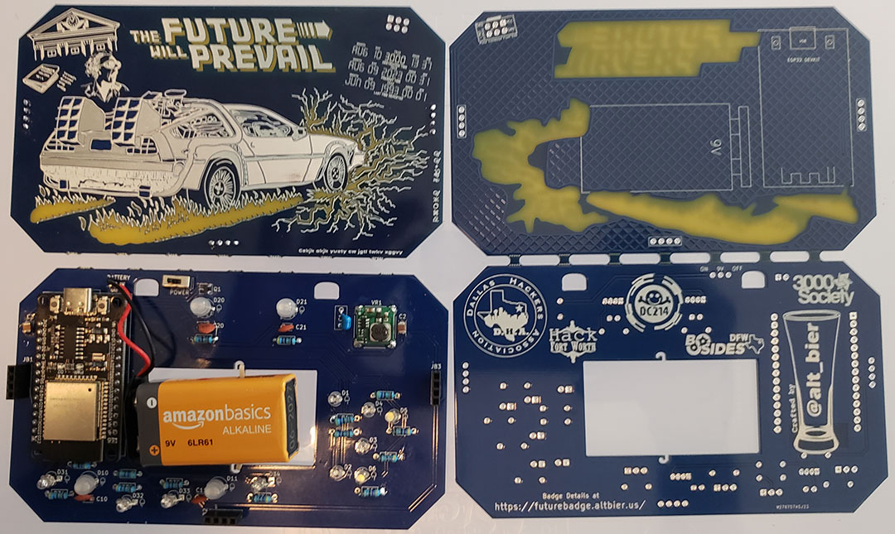
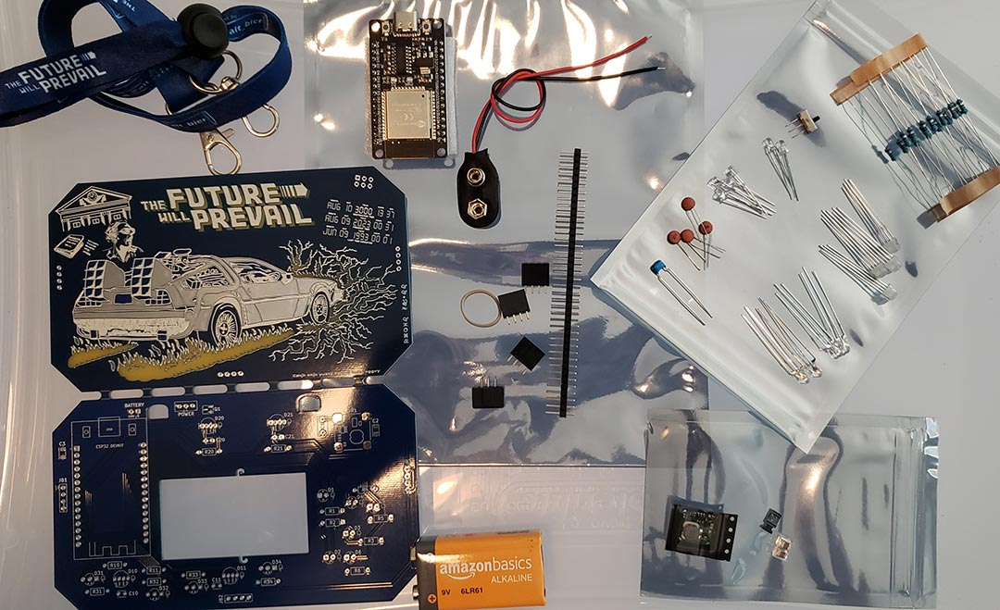

# Future Badge Assembly Instructions

Here are the assembly instructions I put together for the future badge.

## Component List

This is the list of components that you should have available for the assembly

* Main Kit Bag (7x9in) Containing:
  * 1x PCB panel (which breaks apart for top and bottom PCBs)
  * 1x Lanyand
  * 1x 9V Battery
  * 1x Sticker (Not Required for badge Assembly)
  * 1x Assembly Instruction Sheet
  * Large Component Bag (6x8in) Containing:
    * 1x ESP32 WROOM Development board
    * 1x Header Male Breakaway Strip with 1x40 Pins
    * 3x Header Female 1x4 Pins
    * 1x Header Female Keyed 2x3 Pins (Badge SAO connector)
    * 1x 9V Battery connector
    * 1x Rubber Band #8 size
    * Medium Component Bag (4x6in) Containing:
      * 1x THT SS12D00 3-Pin SPDT Switch
      * 4x THT 100nF Ceramic Disc Capacitors
      * 1x THT 10uF 50V X5R 106 5.08mm Multi-Layer Ceramic Capacitor
      * 4x THT WS2812D RPIN 5mm 4-Pin Addressable LEDs
      * 4x THT Two Color (Red-Yellow) 3mm 3-Pin LEDs
      * 4x THT One Color (Blue) 3mm 2-pin Flat Top LEDs
      * 2x THT One Color (White) 3mm 2-pin Round Top LEDs
      * 14x THT 47 Ohm 6.2mm Metal Film Resistors
    * Small Component Bag (3x4in) Containing:
      * 1x SMT CJ3139k 20V 0.66A PNP SOT-23 MOSFET Transistor
      * 1x SMT LMTOE78_03-0.5 12x12mm Step Down Power Regulator
      * 2x SMT 22uF 25V X7R 1210 Multi-Layer Ceramic Capacitor

## Soldering Steps

These are the assembly steps that require soldering.
I have presented them in the order I recommend they be implemented for best results.

Still working on this, check back soon.

## Additional Assembly Steps

These are the additional assembly steps that do not require soldering.
I have presented them in the order I recommend they be implemented for best results.

Still working on this, check back soon.

---

[@alt_bier](https://twitter.com/alt_bier)  - [My Contact Info](https://gowen.net/about)
