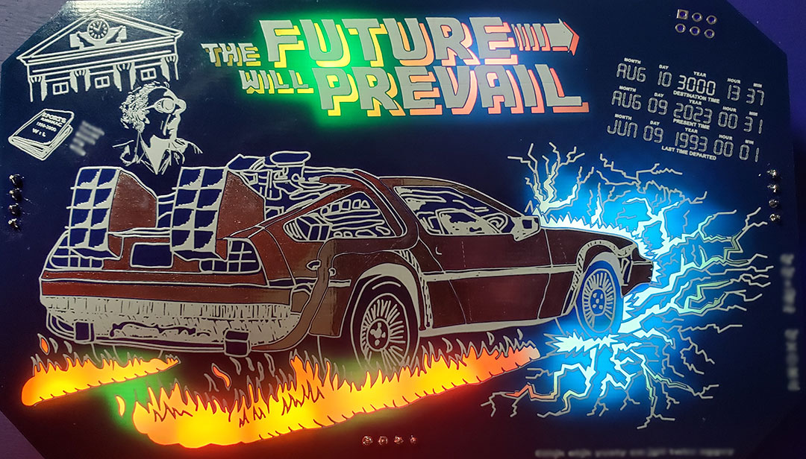

# Welcome

Welcome to the future badge website/repository.

This is where you will find all the details and files and instructions related to my DC31 future badge #badgelife.

The idea for this badge came from the DEFCON 31 theme: "The Future Will Prevail".
This theme made me think of the Back to the Future movies and the famous time traveling DeLorean.

This badge is mostly being provided as a DIY solder kit with a small quantity being provided fully assembled.
If you are looking for instructions on how to assemble the kit then you have come to the right place.

I hope that everyone who gets one of these badges enjoys it.  It was made with love for everyone in the community to enjoy.  And as with all my badges, it is all open hardware/software with all files provided in this repository.  So, if you didn't have a chance to get one of these kits at the con you can always make your own.

-- [@alt_bier](https://twitter.com/alt_bier)  - [My Contact Info](https://gowen.net/about)

---

# Sponsors

I want to thank all of our sponsors from the Indiegogo campaign that made this badge possible.

[Click this link to see the sponsor list.](future_badge_sponsors.md)

# Kit Assembly

Assembly Instructions for the Future Badge kit can be found here: [Badge Assembly](future_badge_assembly.md)

An assembly walkthrough video can be found here:
COMING SOON

# Details

As stated in the welcome, the idea for this badge came from the DEFCON 31 theme: "The Future Will Prevail".
This theme made me think of the Back to the Future movies and the famous time traveling DeLorean.
Having done a car on a previous badge (Godzilla vs Bladerunner) I saw this as an opportunity to improve on that by making the car capacitive touch sensitive and the fact that the DeLorean in the BTTF movies was metalic silver made this a perfet fit.

In keeping with the theme I wanted to make the badge look like a BTTF movie poster and shape it like a movie ticket.
I think the final design was sucessful on both accounts.

I made a design choice to use back lit solder mask voids and two PCBs to sandwich the components hiding them and highlighting the art.
Having seen other groups do these things so sucessfully in the past (looking at you DC540!) I wanted to tackle this and I think it turned out great.

Since I had not used an ESP on a badge yet I decided to use the ESP32 on this one.
One of the cool things about the ESP32 is the built in wireless.
So, we are planning on making use of that with an embedded CTF challenge (if we can get the code working in time LOL)

Speaking of challenges, this badge includes some crypto challenges right on the front silkscreen art.
Nothing too difficult, but a fun feature that will be used in the code based challenge.

In keeping with my goal of making the badge code accessible to people I decided to use Arduino code for this badge.
This presented its own set of challenges as Arduino code it not nativley very mobile and requires lots of local config to match an environment.
I came up with a fix for this by using the Arduino CLI instead of the IDE and using a locally provided config file and scripts for setup, compile, and upload.
See the code readme file for details.

The final design choice that I do have some regrets about is the use of a 9V battery.
I thought it would be cool since many Arduino and other dev board projects use a 9V but I don't recall ever seeing one on a badge.
I know now why 9V batteries are not used on badges.
I was warned to change it but was too far along the development path to do so.
My first prototype board only lasted about 2 hours on a 9V with the wifi off.
Thanks to true from the Whiskey Pirate Crew I was able to get a voltage regulator circuit added that now makes the badge run for 7 to 8 hours on a 9V.
Still not ideal and I'll be providing two 9V batteries in each kit and have lots of spares at defcon to compensate.
But it looks cool right?

# Code

The code is detailed in the github repo which can be found here: [Code Documentation](https://github.com/gowenrw/future_badge/blob/main/code/README.md)

The CTF challenge is a compiled library so you won't gain any hints there.
That source code will be released after defcon.

The rest of the code is open to see and modify as you will.
